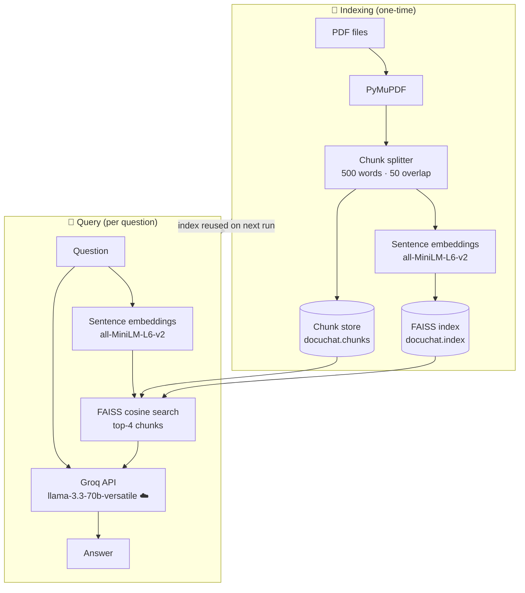
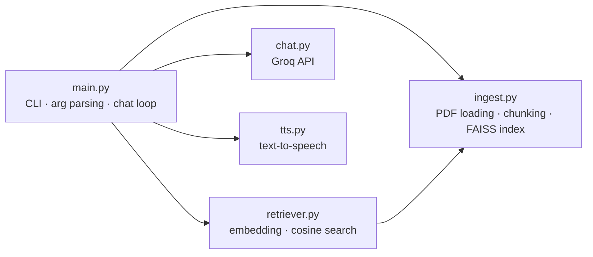

# docuchat

A command-line tool for chatting with PDF documents using RAG (Retrieval-Augmented Generation). Load one or more PDFs, ask questions in natural language, and get answers grounded in the document content.

## How it works

1. **Index** — your PDFs are split into overlapping text chunks, converted to vector embeddings, and stored in a local FAISS index.
2. **Retrieve** — when you ask a question, the 4 most semantically similar chunks are fetched from the index.
3. **Generate** — the question and retrieved chunks are sent to Groq's LLM, which answers based solely on that content.

Everything runs locally except the final LLM call to Groq.



## Prerequisites

- Python 3.14+
- [uv](https://docs.astral.sh/uv/) — install with `pip install uv` or `curl -LsSf https://astral.sh/uv/install.sh | sh`
- A free Groq API key — get one at [console.groq.com](https://console.groq.com)

## Setup

```bash
# Clone and enter the project
git clone <repo-url>
cd docuchat

# Install dependencies
uv sync

# Create a .env file with your Groq API key
echo "GROQ_API_KEY=your_key_here" > .env
```

> **Windows note:** if you're on a corporate network with a custom certificate authority, the `truststore` package (included as a dependency) patches Python's SSL to use the Windows certificate store automatically.

## Usage

```bash
# Show help
uv run src/main.py --help

# Chat with a single PDF (indexes on first run, reuses index on subsequent runs)
uv run src/main.py document.pdf

# Chat with multiple PDFs at once
uv run src/main.py report.pdf manual.pdf notes.pdf

# Resume chat with the existing index (no PDF needed if already indexed)
uv run src/main.py

# Reset the index (e.g. when you want to switch documents)
uv run src/main.py --reset

# Reset and immediately index new documents
uv run src/main.py --reset document.pdf

# Read answers aloud in Swedish (default)
uv run src/main.py document.pdf --speak

# Read answers aloud in English
uv run src/main.py document.pdf --speak --lang en
```

During a session, type your question at the `You:` prompt and press Enter. Type `quit`, `exit`, or `q` to stop.

### Example session

```
Reading handbook.pdf...
  3 chunks from handbook.pdf
Creating embeddings for 3 chunks...
Index saved. 3 chunks from 1 document(s).

docuchat — type your question or quit to exit.

You: How many vacation days do employees get?
Answer: Employees are entitled to 30 vacation days per year...

You: quit
Exiting.
```

### Index caching

The index is saved to `docuchat.index` and `docuchat.chunks` in the working directory. On subsequent runs with the same PDF, indexing is skipped and the existing index is reused. Use `--reset` to force a rebuild.

## Running the tests

```bash
uv run pytest
```

Tests cover all five modules (`ingest`, `retriever`, `chat`, `main`, `tts`) with 53 test cases. External dependencies — the Groq API and the sentence-transformers model — are mocked so no API key or internet connection is needed to run the test suite.

To generate a sample PDF for manual testing:

```bash
uv run src/create_test_pdf.py
```

This produces `handbook.pdf` in the current directory — a fictional employee handbook with concrete facts you can query, such as vacation days, salary review dates, and remote work policy.

## Project structure



```
docuchat/
├── src/
│   ├── main.py              # CLI entry point, argument parsing, chat loop
│   ├── ingest.py            # PDF loading, text chunking, FAISS index building
│   ├── retriever.py         # Embedding-based chunk retrieval
│   ├── chat.py              # Groq API integration
│   ├── tts.py               # Text-to-speech via gTTS + Windows MCI
│   ├── conftest.py          # Shared pytest fixtures
│   ├── create_test_pdf.py   # Test PDF generator
│   ├── chat_test.py
│   ├── ingest_test.py
│   ├── main_test.py
│   ├── retriever_test.py
│   └── tts_test.py
├── pyproject.toml     # Dependencies and pytest config
├── spec.md            # Full project specification
├── .env               # Your API key (not committed)
```

## Tech stack

| Component       | Technology                                              |
|-----------------|---------------------------------------------------------|
| LLM             | Groq API — `llama-3.3-70b-versatile`                    |
| Embeddings      | `sentence-transformers/all-MiniLM-L6-v2` (runs locally) |
| Vector database | FAISS (runs locally)                                    |
| PDF parsing     | PyMuPDF                                                 |
| CLI / UI        | Rich                                                    |
| Text-to-speech  | gTTS + Windows MCI (`winmm.dll`)                        |
| Package manager | uv                                                      |

## Configuration

| Variable        | Description                        |
|-----------------|------------------------------------|
| `GROQ_API_KEY`  | Required. Get free at console.groq.com |

## Troubleshooting

**`GROQ_API_KEY` not set** — create a `.env` file in the project root with `GROQ_API_KEY=your_key_here`.

**SSL certificate errors** — if you're on Windows behind a corporate proxy, make sure `truststore` is installed (`uv sync` handles this). If errors persist, check that your system certificate store includes the corporate CA.

**Slow first run** — the `all-MiniLM-L6-v2` embedding model (~90 MB) is downloaded from HuggingFace on first use and cached in `~/.cache/huggingface`. Subsequent runs are fast.

**Answers seem wrong or incomplete** — the model only uses the 4 retrieved chunks as context. If your document is large, relevant content might not rank in the top 4. Try rephrasing your question to be more specific.

**Switching documents** — if you run with a different PDF without `--reset`, the old index is reused and the new PDF is ignored. Always pass `--reset` when changing documents.
